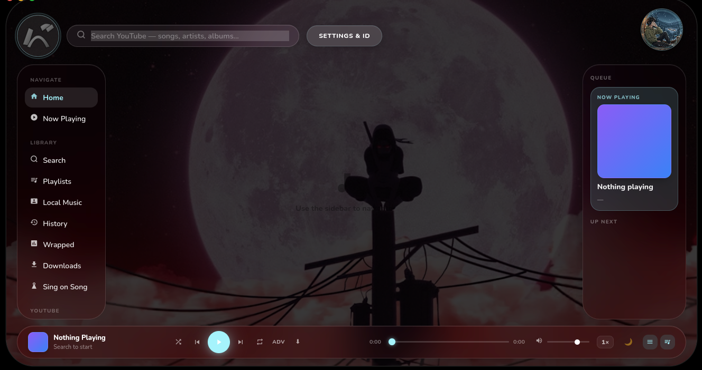
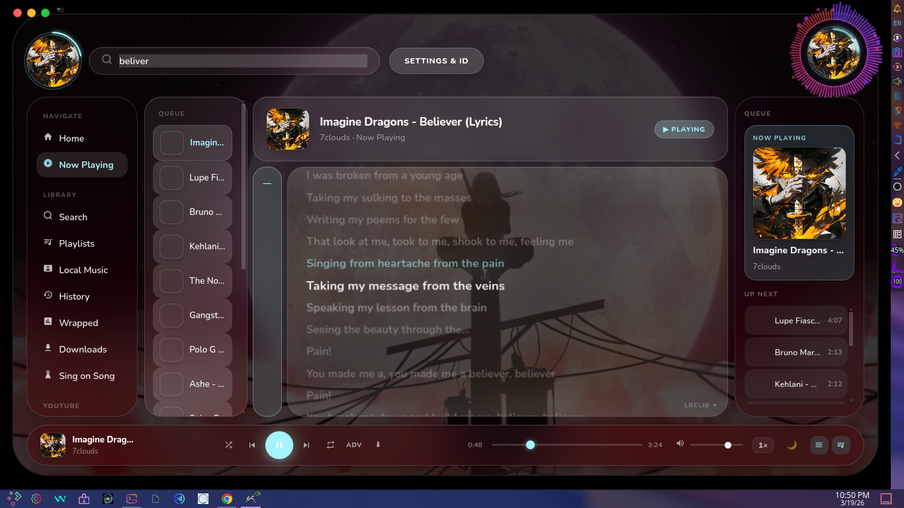
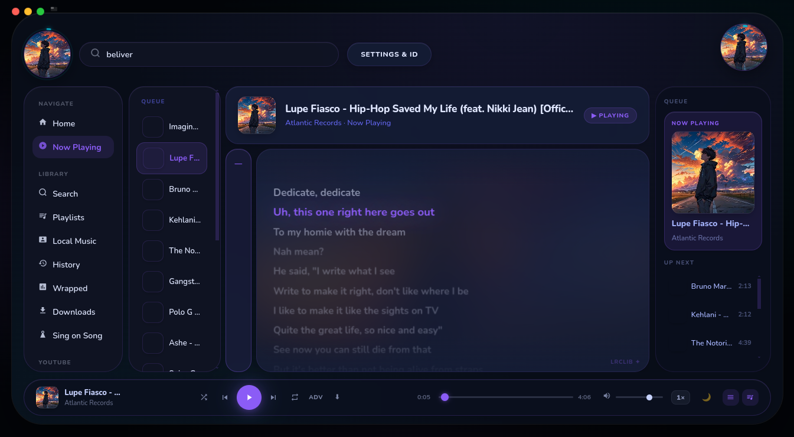
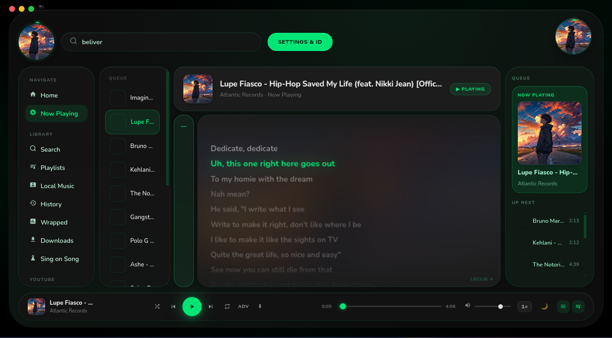
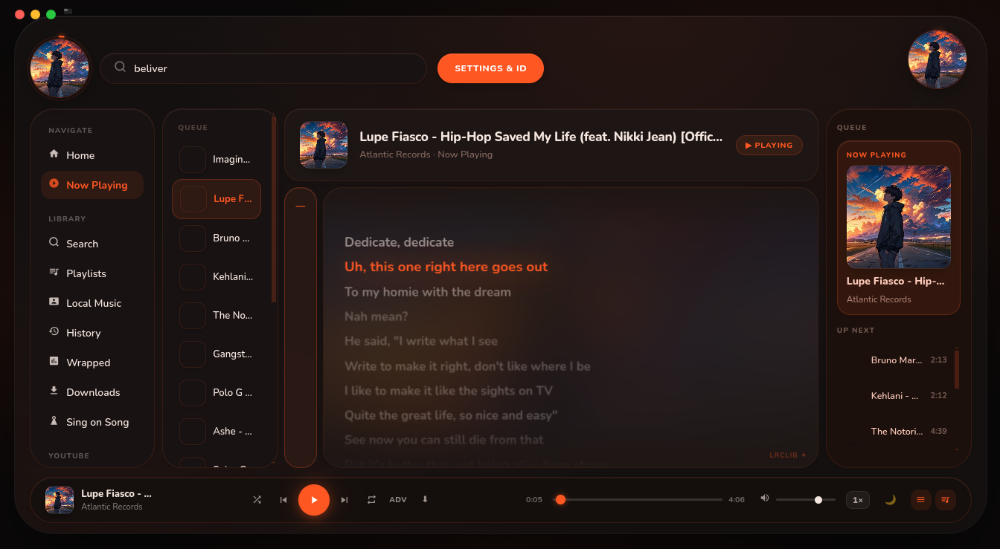
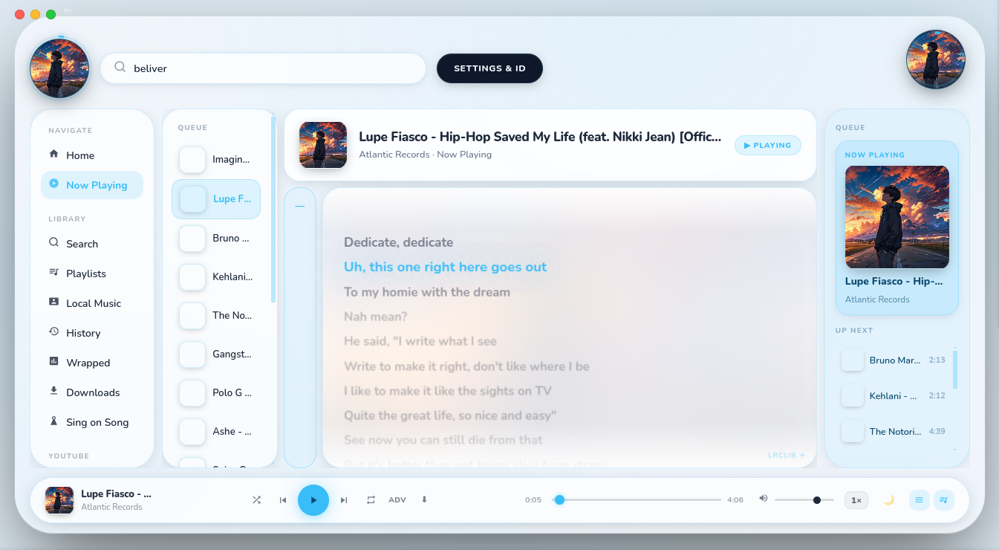
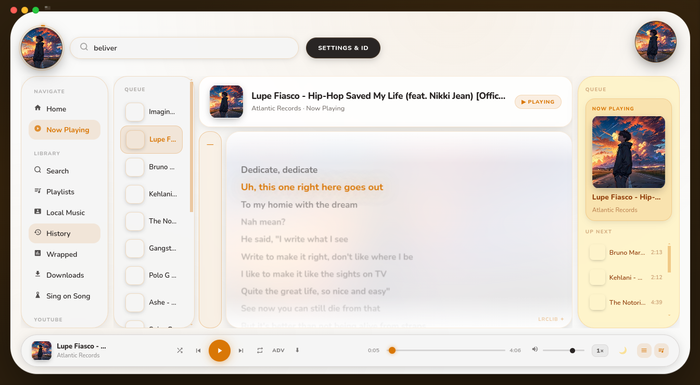
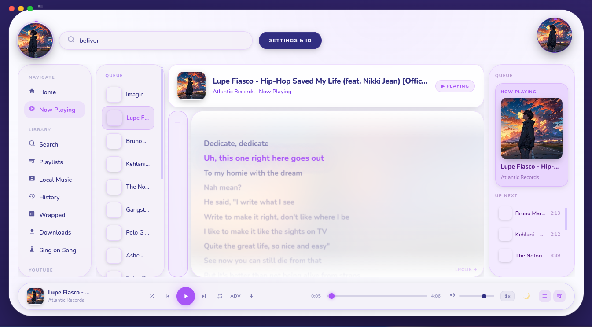
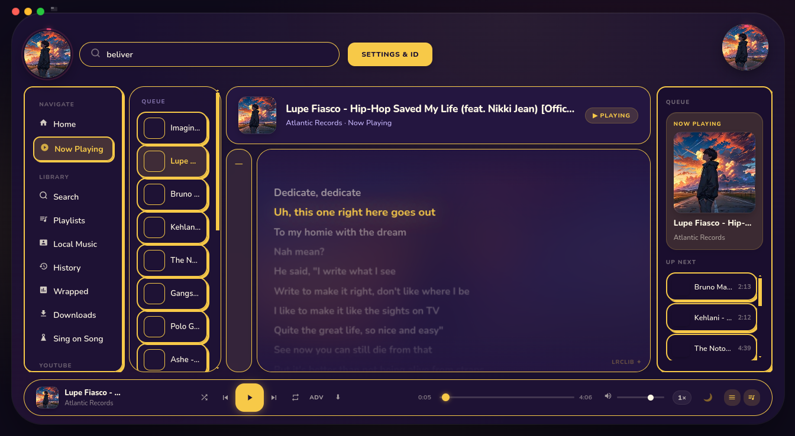

<div align="center">


# Seeky

**The music player that actually gets you.**

[](https://github.com/tarun922/seeky/releases/latest)
[](#-installation)
[](https://discord.gg/Tjv3pa3PU9)
[](https://github.com/tarun922/seeky/stargazers)

<br/>

> Spotify imports. YouTube playlists. Local files. Live lyrics. Shazam. Discord RPC.  
> All in one gorgeous desktop app — **free, forever.**

<br/>

[**⬇️ Download for Windows**](https://github.com/tarun922/seeky/releases/latest/download/Seeky-Setup-x.x.x.exe) &nbsp;·&nbsp;
[**macOS**](https://github.com/tarun922/seeky/releases/latest/download/Seeky-x.x.x.dmg) &nbsp;·&nbsp;
[**Linux**](https://github.com/tarun922/seeky/releases/latest)

<br/>

<!--
  DROP YOUR SCREENSHOTS HERE
  Save them to assets/screenshots/ in this repo, then update the paths below.
  Tip: an animated GIF of themes switching = instant virality
  Tools: ScreenToGif (Windows), Peek (Linux), Kap (macOS)
-->

| Home | Now Playing | Themes |
|:----:|:-----------:|:------:|
|  |  |  |

</div>

---

## ✨ Why Seeky?

Every music app makes you pick a lane — *local only* or *streaming only*. Seeky does both. It's a free, offline-first desktop music hub that pulls everything into one place without the monthly bill.

No account required. No ads. No upsells. Just music.

---

## 🎯 Features

### 🎵 Play Everything
Local files, YouTube streams, Spotify-imported playlists — all in one unified library. Supports `mp3`, `flac`, `opus`, `ogg`, `wav` and more.

### 📥 Spotify Import
Import your Spotify playlists directly into Seeky. Your library follows you, subscription or not.

### 📺 YouTube Playlists
Paste any YouTube playlist URL and play it like a local playlist, with smooth caching for skip-free listening.

### 🎤 Live Synced Lyrics
Scrolling lyrics on the Now Playing screen. Never miss a word.

### 🕵️ Shazam / Song ID
Hear something you don't recognise? Press `[R]` anywhere in the player — Seeky records 8 seconds from your mic and identifies the track instantly via ACRCloud.

### 🎨 7 Hand-Crafted Themes

Every theme is hand-crafted — not just a color swap. Pick your vibe.

<div align="center">

| 🌌 Midnight Aurora | 🕳️ Cosmic Void | 🔴 Molten Obsidian |
|:------------------:|:--------------:|:------------------:|
|  |  |  |

| 🔵 Powder Blue | 🌅 Golden Hour | ⬜ Arctic Pearl |
|:--------------:|:--------------:|:---------------:|
|  |  |  |

| 🖼️ Toon Dark |
|:------------:|
|  |

</div>

### 📊 Wrapped — Year-Round Stats
Top artists, top tracks, listening streaks, total hours. Available any time — not just December.

### 🎮 Gamer Mode
Auto-ducks music volume when game audio kicks in. Never fumble with the mixer mid-match again.

### 💬 Discord Rich Presence
Your Discord status shows what you're listening to — song, artist, album art, play state.

### 📱 Mobile Remote
Open Seeky's remote URL on your phone (same Wi-Fi) to control playback without touching your PC.

### 🎵 Mini Player
An always-on-top compact player for when you want controls without the full window.

### 🔌 Plugin System
Extend Seeky with community-built plugins. Gamer Mode ships built-in — more coming.

### ↔️ Crossfade & Visualizer
Smooth crossfade between tracks and a real-time audio visualizer on the Now Playing screen.

---

## 📦 Installation

### Windows
1. Download `Seeky-Setup-x.x.x.exe` from [Releases](https://github.com/tarun922/seeky/releases/latest)
2. Run the installer — done

### macOS
1. Download `Seeky-x.x.x.dmg`
2. Open and drag Seeky to Applications
3. First launch: right-click → Open to bypass Gatekeeper

### Linux — AppImage
```bash
chmod +x Seeky-x.x.x.AppImage
./Seeky-x.x.x.AppImage
```

### Linux — deb
```bash
sudo dpkg -i seeky_x.x.x_amd64.deb
```

> Seeky checks for updates automatically on launch and installs them silently.

---

## 🔧 Setup Guides

### Song ID (Shazam)
1. Free account at [ACRCloud](https://www.acrcloud.com/)
2. Create a project → copy Host, Key, Secret
3. Seeky → Settings → Integrations → ACRCloud

Free tier: 1,000 identifications/day.

### Discord Rich Presence
1. [Discord Developer Portal](https://discord.com/developers/applications) → New Application
2. Copy the Application ID
3. Seeky → Settings → Discord → paste Client ID

---

## 🗺️ Roadmap

- [ ] Last.fm scrobbling
- [ ] Equalizer
- [ ] Plugin marketplace
- [ ] Sleep timer
- [ ] Collaborative playlists
- [ ] Tidal / Apple Music import

Have an idea? [Open an issue](https://github.com/tarun922/seeky/issues) or suggest it on [Discord](https://discord.gg/Tjv3pa3PU9).

---

## ❓ FAQ

**Is it really free?**  
Yes. No ads, no subscription, no account needed for core features.

**Does it work offline?**  
Fully, for local files. YouTube and Spotify import require internet.

**Is my data private?**  
Seeky doesn't send your library or listening data anywhere. Song ID and Discord RPC only activate when you enable them.

**Where's the source code?**  
Seeky is currently closed-source. A plugin API and community extensions are planned.

---

<div align="center">

Made with ❤️ and way too many late nights.

**[⭐ Star this repo if Seeky made your day better](https://github.com/tarun922/seeky)**

*Seeky is not affiliated with Spotify, YouTube, or Discord.*

</div>
